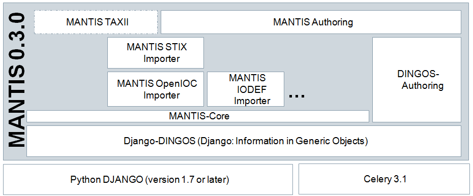

..  documentation master file, created by
   sphinx-quickstart on Sun Feb 17 11:46:20 2013.
   You can adapt this file completely to your liking, but it should at least
   contain the root `toctree` directive.

The MANTIS Cyber-Intelligence Management Framework
==================================================

MANTIS provides a framework for managing cyber threat intelligence
expressed in standards such as STIX, CybOX, IODEF.

The heavy lifting is done in the following Django Apps:

- `django-dingos`_
- `django-mantis-core`_
- `django-mantis-stix-importer`_
- `django-mantis-openioc-importer`_
- `django-mantis-iodef-importer`_
-  django-mantis-taxii (under development)

   MANTIS architecture

Important resources:

* Access to the Mantis source code for installation (either
  via ``git pull`` (recommended) or as download via the
  `Mantis Github Repository`_

* All issues regarding Mantis and its components are tracked
  on the `Mantis Issue Tracker`_

* Documentation: see below

.. toctree::
   :maxdepth: 2

   readme
   screenshots
   what_mantis_is
   installation
   quickstart
   mantis_developers_guide
   contributing

Indices and tables
==================

* :ref:`genindex`
* :ref:`modindex`
* :ref:`search`

.. _Mantis Github Repository: https://github.com/siemens/django-mantis
.. _Mantis Issue Tracker: https://github.com/siemens/django-mantis/issues?state=open

.. _Django: https://www.djangoproject.com/
.. _STIX: http://stix.mitre.org/
.. _CybOX: http://cybox.mitre.org/
.. _OpenIOC: http://www.openioc.org/
.. _IODEF (RFC 5070): http://www.ietf.org/rfc/rfc5070.txt

.. _django-dingos: https://github.com/siemens/django-dingos/blob/master/docs/what_dingos_is_all_about.rst
.. _django-mantis-core: https://github.com/siemens/django-mantis-core
.. _django-mantis-stix-importer: https://github.com/siemens/django-mantis-stix-importer
.. _django-mantis-openioc-importer: https://github.com/siemens/django-mantis-openioc-importer
.. _django-mantis-iodef-importer: https://github.com/siemens/django-mantis-iodef-importer
