Screenshots
===========

To get an idea of what MANTIS currently provides, take a look at the following screenshots.

.. contents::

Login
-----

Django's standard login screen, rendered with the Grappelli skin
that is used by Mantis. You can customize Django to do
authentication differently (see the 
`Django documentation on customizing authentication`_.)

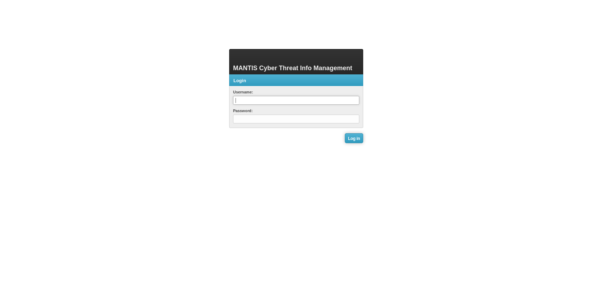

   The login screen

Menus
-----

In its default configuration, MANTIS currently presents three menus:

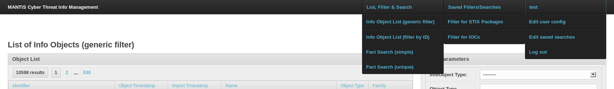

   The menus presented to the user by MANTIS

* A menu over which the existing search/filter views are accessible
* A menu over which saved searches are accessible
* A menu for viewing/editing user-specific information

Viewing imported information objects
------------------------------------

The screenshot below shows the overview of imported information objects right
after import of MITRE's conversion of the 
`MITRE STIX conversion of APT-1 report`_. We imported the top-level STIX package
and the Appendix G with full indicators of compromise (i.e., Mandiant OpenIOC
is embedded into the STIX XML). The count shows a quite large number of objects,
and we obviously need a way to find our way around. So in the next step,
we filter the list a bit.

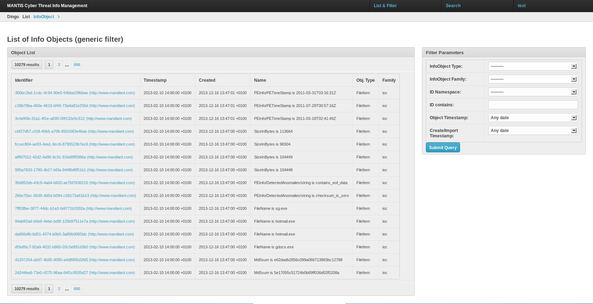

   The list of information objects (standard URL: ``/mantis/View/InfoObject``)

Filtering
---------

The filter box on the page showing the information object list allows filtering with respect
to several commonly used criteria. Here, we filter by information object type, and chose
the ``STIX_Package``.

.. figure:: images/mantis_filter_infoobject_types.PNG
   :scale: 100 %
   :align: center

   Filtering with respect to information object types

Filtering results for ``STIX_Packages`` yields two results: the package that represents
the top-level of the APT-1 report and the package that represents appendix G.

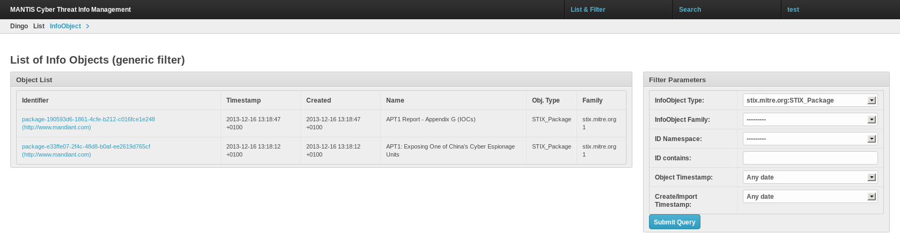

   Result of filtering for ``STIX_Packages``

Viewing an info object
----------------------

Clicking on the STIX package for the top-level of the APT-1 report shows
MANTIS's representation of the info object:

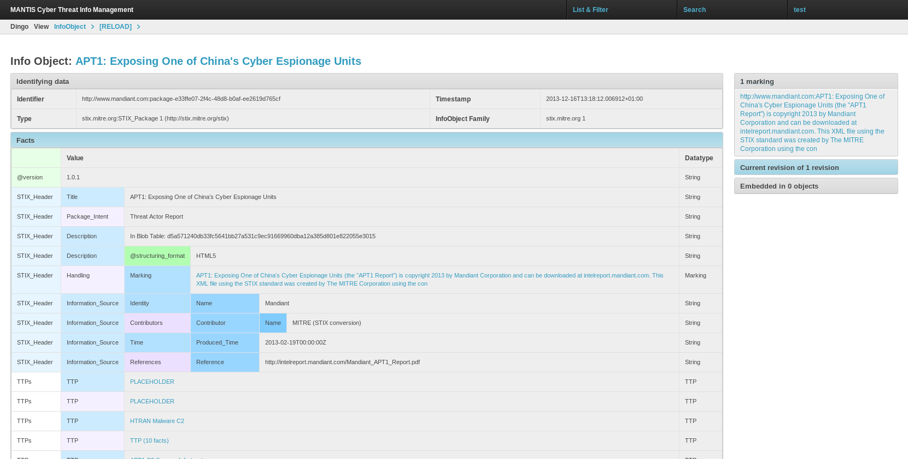

   View of STIX package presenting top-level of APT 1 report

* At the top, we have identifiying information.

* The bulk of the display in the center concerns
  the facts contained in the object (the color coding shows the structuring of the
  facts -- it takes a bit of getting used to ... but this is just a view after
  all: you can create a view that suits you better.)

  The fact values that appear in blue are actually links to other
  info objects that have been extracted from the STIX package. You see
  two objects called ``PLACEHOLDER``: as it turns out, the STIX package
  references these two objects without actually defining them. Would
  they be imported at a later point of time (identified by identifier
  and namespace of the identifier), the placeholders would
  be overwritten.

* The view also shows the marking that has been extracted and associated
  with this info object and all other info objects extracted from the
  STIX package.

* Curently, there is a single revision of the object in the system. If there
  were more revisions, these would be shown (as well as whether the revision
  you are looking at is the most recent revision).

* This information object is not embedded in another info object; if it were,
  information about these objects would be displayed.

Viewing another info object
---------------------------

Clicking on the value of the third fact with fact term ``TTPs\TTP``, 
we see the facts contained in this info object ... and now there
is also information about info objects in which this info object is
embedded.

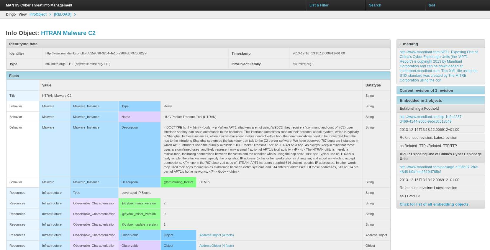

   Viewing a TTP object. Standard URL for viewing is ``mantis/View/InfoObject/<object-nr>``

Clicking once more, this time into an address object (here, the pre-defined
naming schema did not work and produced the name ``AddressObject (4 facts)`` --
but you can configure additional naming schemas), we view another info object:

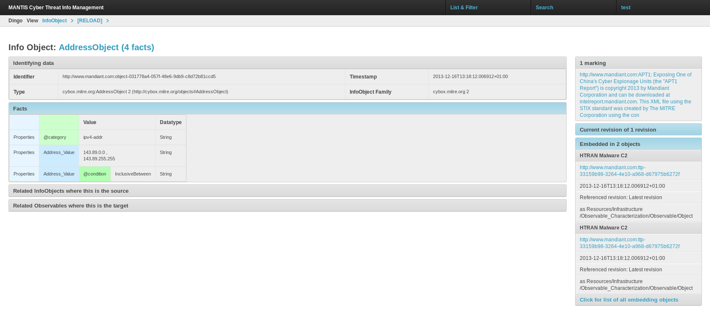

   Viewing an address object

Again, we have information about which objects this particular object is embedded in:
we get two results, and two times the same object, because it has been referenced
two times (once by mistake, it seems.)

Viewing the JSON representation
-------------------------------

Mantis stores objects internally as lists of facts (refer to the
`DINGOS model description`_ to learn more about the internal data model),
but can also produce a JSON representation of each object. 

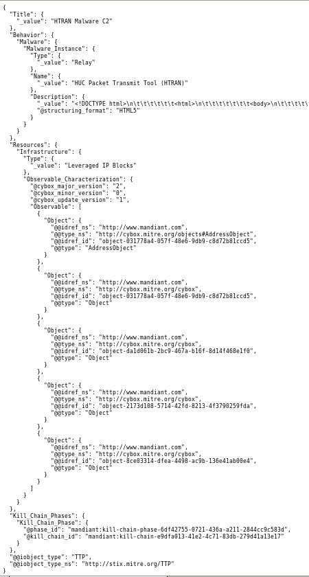

   JSON representation of a STIX TTP object. Standard url is ``mantis/View/InfoObject/<object-nr>/json``

Unfortunately, the JSON representation has still a slight problem: in the last few
lines, the identifiers for ``@phase_id`` and ``@kill_chain_id`` would have to be
treated akin to the "normal" references using ``idref``.

Dealing with embeddings of different standards
----------------------------------------------

STIX is very flexible and allows the embedding of other standards, such as Mandiant's OpenIOC.
For example, the `MITRE STIX conversion of APT-1 report`_ contains one version of the "Appendix G",
that contains embedded OpenIOC indicators. The Mantis STIX importer recognizes such occurrences
and hands off to the Mantis OpenIOC importer.

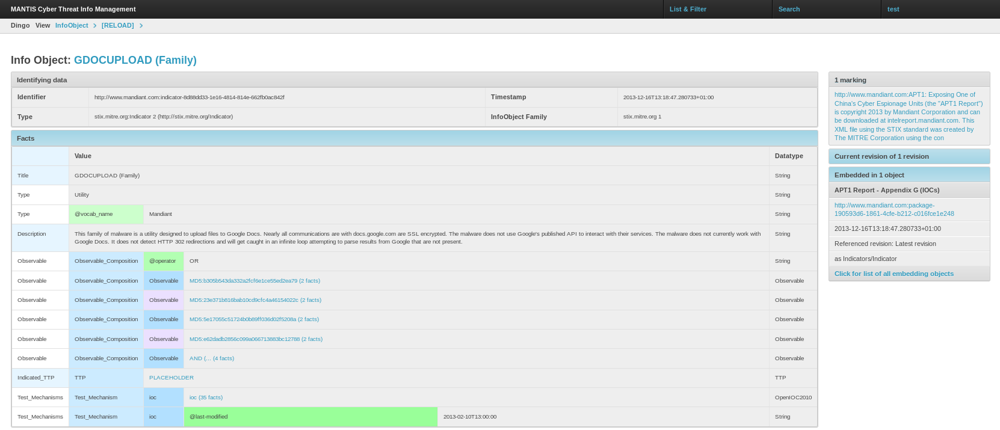

   STIX indicator with embedded OpenIOC indicator (fact with fact term ``Test_Mechanisms/Test_Mechanism/ioc``).

Clicking on the embedded ``ioc`` object (here, the naming went wrong, it should display the value of the ``short_description`` element
in the IOC) in line ``Test_Mechanisms/Test_Mechanism/ioc`` yields a view of the imported OpenIOC info object.

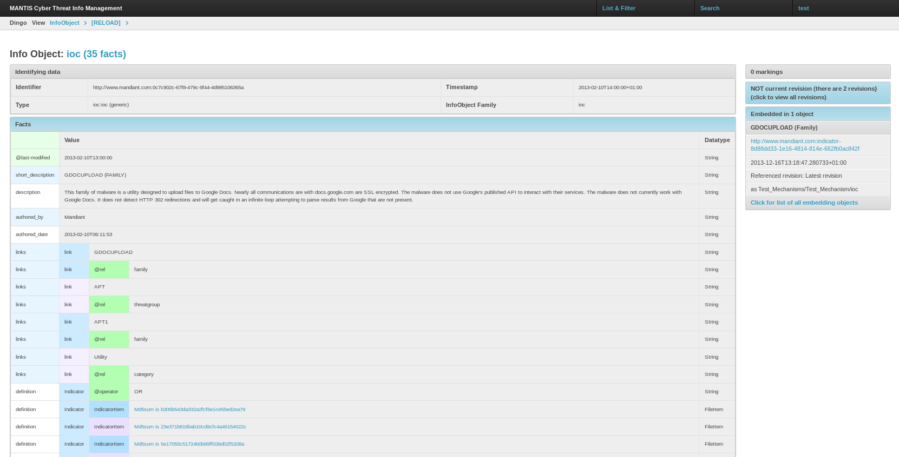

   An OpenIOC indicator

 

Searching and viewing results
-----------------------------

We also can search for facts:

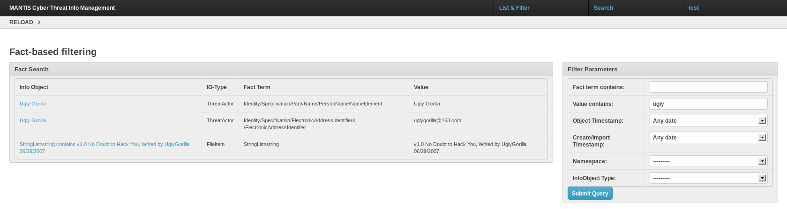

   Searching for values

The search page allows us to search for values, e.g. the word ``ugly``.
This yields several results. The display shows the info objects in which
the value occurs, the info object type of these objects, and the
fact term under which the value occurs.

Clicking on one of the objects shows the object and marks in red
the occurrence of the searched term.

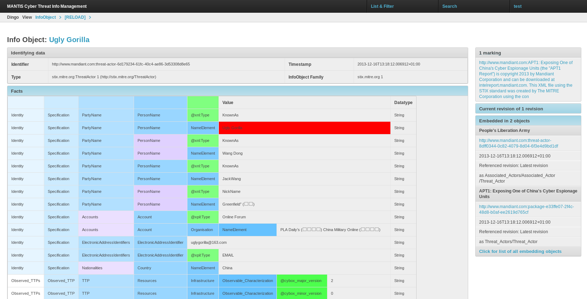

   Viewing a search result

Editing user-specific data
--------------------------

Currently, each user can edit his user configurations and saved searches.

Edit user configurations
;;;;;;;;;;;;;;;;;;;;;;;;

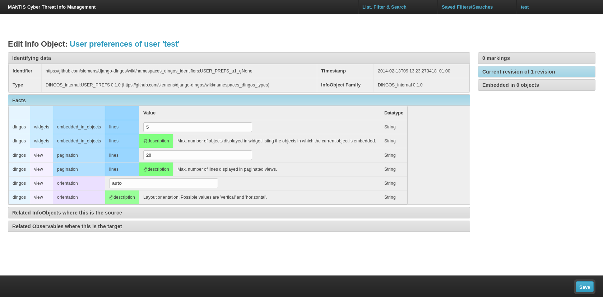

   The view for editing the user configurations

Currently, there is only a minimum of user configurations available -- these
will be extended in future releases of MANTIS. Also, the framework for
managing user configurations is very flexible and can be used for own development
(see the `relevant documentation of DINGOS`_.)

.. _relevant documentation of DINGOS: http://django-dingos.readthedocs.org/en/latest/dingos_guide_to_userconfiguration.html

Edit user configurations
;;;;;;;;;;;;;;;;;;;;;;;;

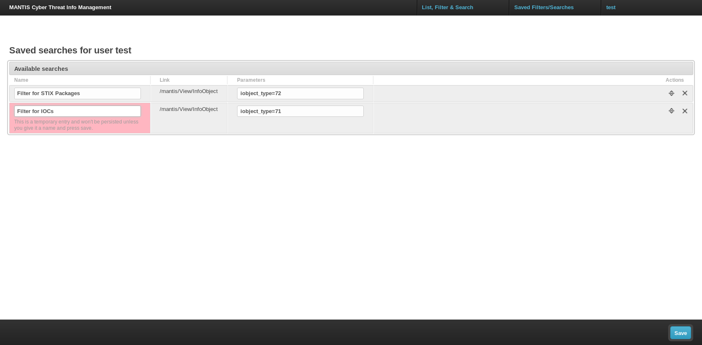

   The view for editing saved searches

After pressing the 'Save Search' button on the filter view, users are presented with a view
that allows them to add the new search and edit the exiting ones; the view is also
available via the user-specific menu in the top right of the screen.

A look at the admin interface
-----------------------------

Django features a very powerful admin interface. We us it to view and manage
enumerables such as info object types, fact data types, etc.

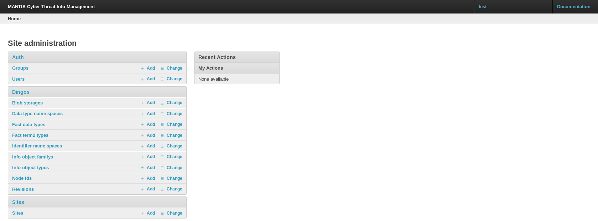

   The Django admin interface with overview of DINGOS's models

For example, here the list of info object types in the system.

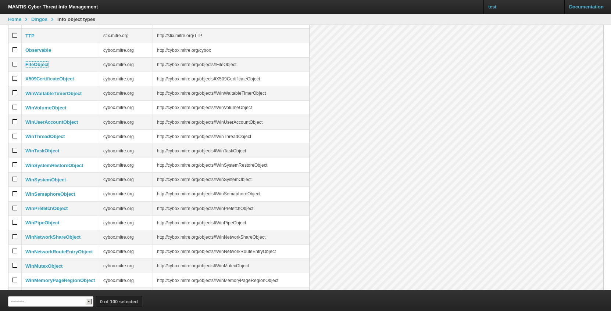

   Admin overview of the info object types

Access to the info object types via the admin interface is especially
relevant, because naming schemas that govern how objects are named
are defined per info object type.

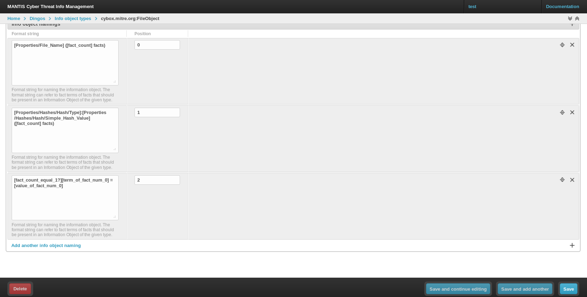

   Configuration of naming schemas for file objects

.. _Django documentation on customizing authentication: https://docs.djangoproject.com/en/dev/topics/auth/customizing/

.. _MITRE STIX conversion of APT-1 report: http://stix.mitre.org/downloads/APT1-STIX.zip

.. _DINGOS model description: http://django-dingos.readthedocs.org/en/latest/dingos_model_overview.html

